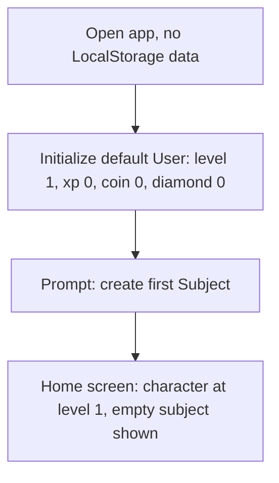
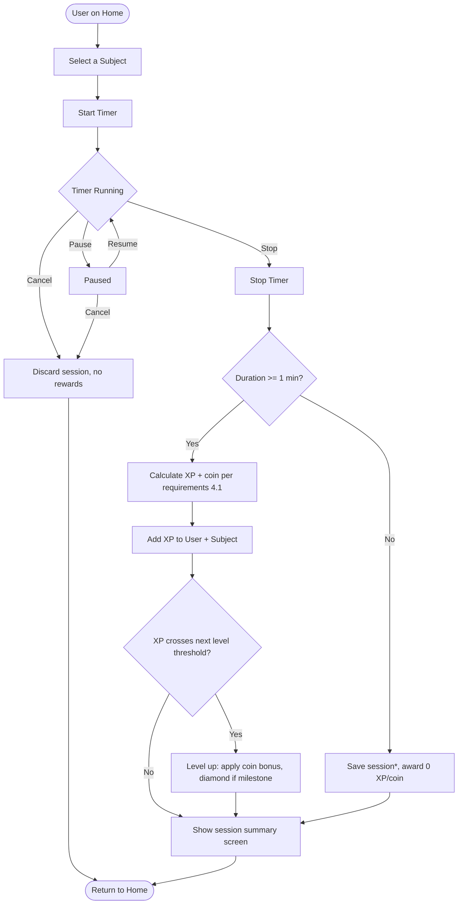
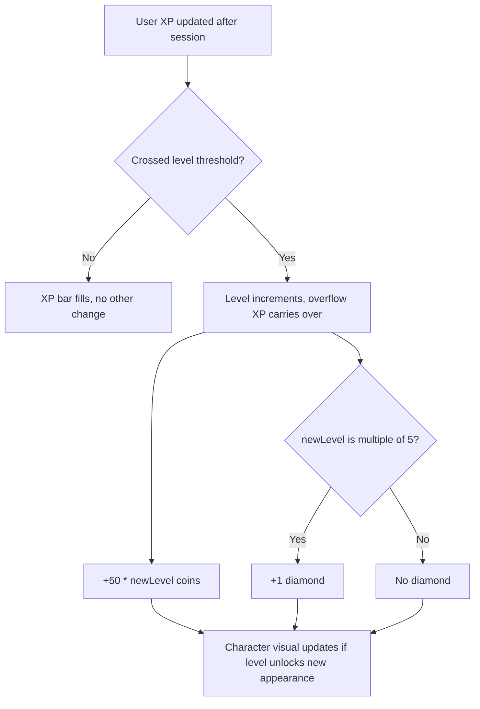
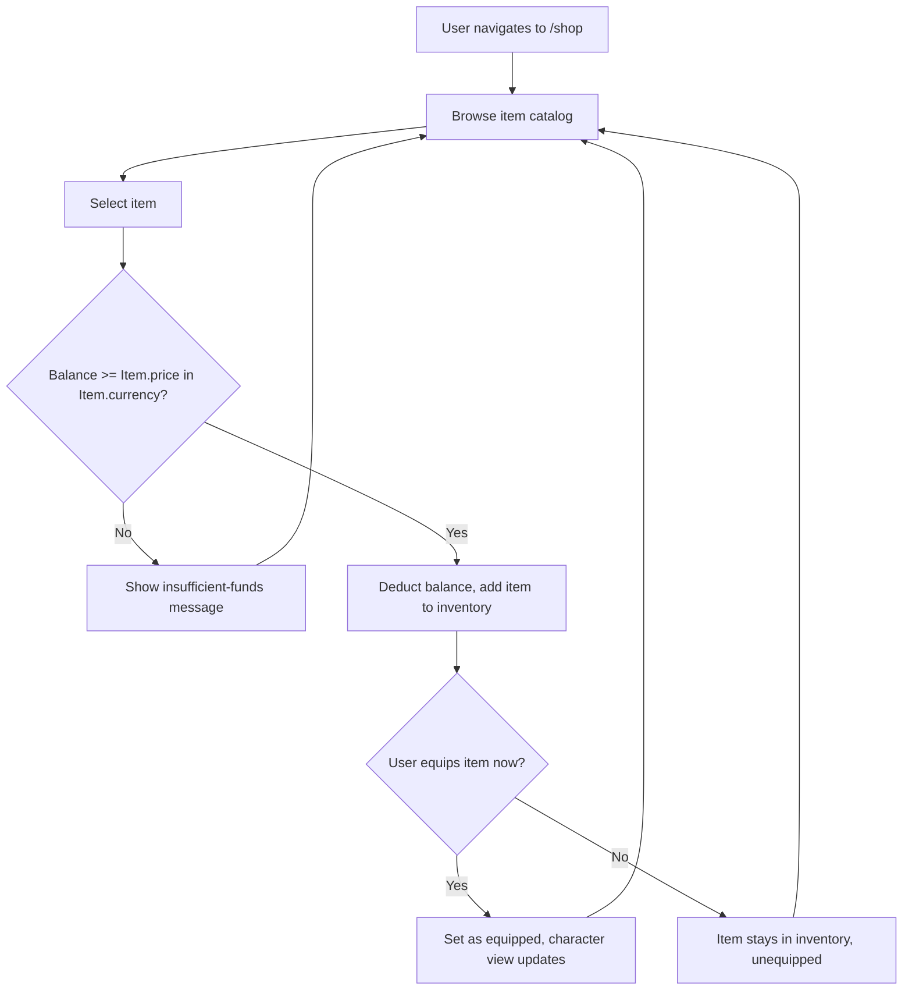
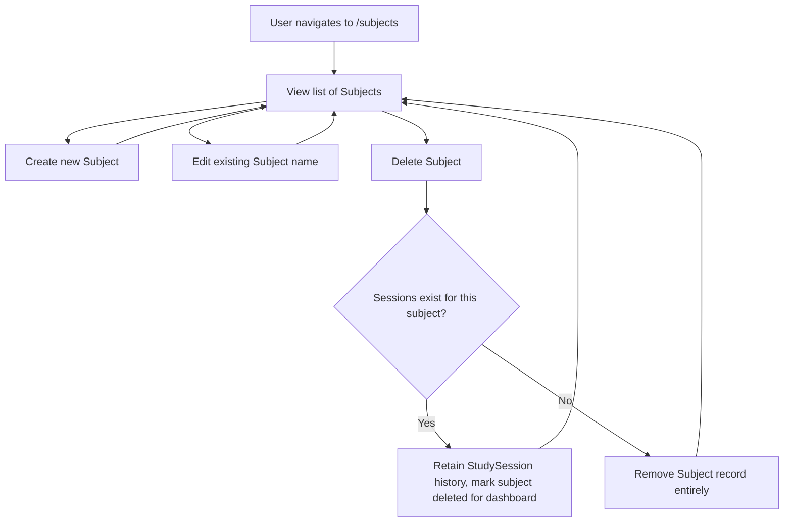
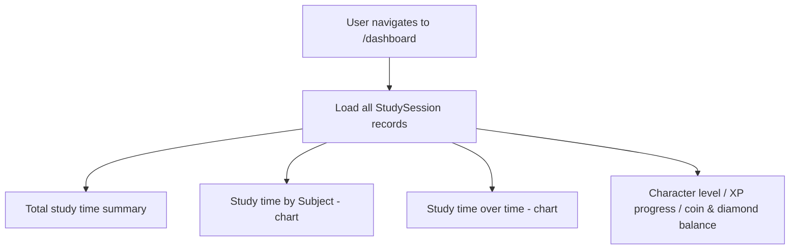
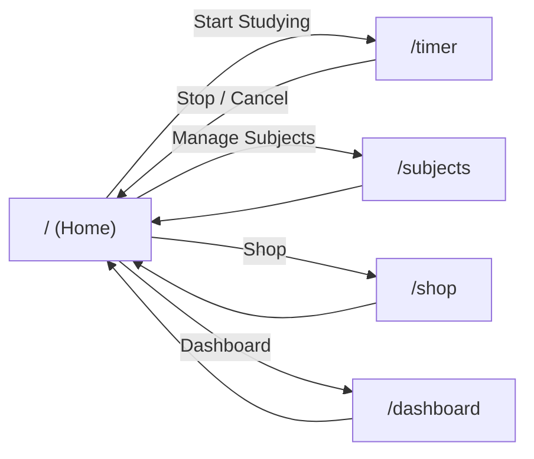

# User Flow — v1.0 Local MVP

Companion to `requirements.md`. Describes screen-to-screen navigation and the
step-by-step user journeys for each core loop.

---

## 1. Information Architecture

Proposed v1 routes (revises `folder_structure.md`'s example — `ranking` dropped
per `requirements.md` §6.1, since it needs multi-user data not available in v1):

```
/               Home — character view, coin/diamond HUD, "Start Studying" entry
/timer          Active study session (subject select → stopwatch)
/dashboard      Study stats & charts
/shop           Browse & purchase items
/subjects       Manage subjects (create / edit / delete)
```

All routes read/write the same LocalStorage-backed state (via Zustand store),
so navigation never loses in-progress data except an unsaved running timer
(see §3).

---

## 2. First-Time User Flow (Onboarding)



- No nickname/account step — v1 has no login. A default `User` record is created
  silently on first load.
- The user must create at least one `Subject` before the timer can be used
  (a session requires a `subjectId`).

---

## 3. Core Loop: Study Session Flow

This is the primary loop the entire app is built around: **study → earn → grow**.



\* Whether sub-1-minute sessions are saved at all (with 0 reward) or discarded
entirely is an implementation detail; either is acceptable per `requirements.md`.

### Step-by-step

1. User lands on Home, sees character + HUD (level, XP bar, coin, diamond).
2. User taps "Start Studying" → navigates to `/timer`.
3. User selects a `Subject` from a dropdown/list.
4. User starts the stopwatch. Timer counts up; Pause/Resume available.
5. User stops the timer → session duration is finalized.
6. App computes `xpEarned` / `coinEarned` (requirements §4.1) and writes a new
   `StudySession` record.
7. App adds XP to both the global `User` and the selected `Subject`.
8. App checks level thresholds (requirements §4.2) for both; if crossed, applies
   level-up rewards (requirements §4.3) — this may cascade (e.g. large session
   duration triggers multiple level-ups).
9. App shows a session summary (XP gained, coins gained, level-up notice if any).
10. User returns to Home; character visual and HUD reflect new state.

---

## 4. Character Growth Flow



Character appearance changes are read from `User.level` and any **equipped**
`Item` (see §5) — no separate "growth" screen is needed; the Home view always
reflects current state live.

---

## 5. Shop Flow



- Coin-priced items: everyday cosmetics, affordable from normal session rewards.
- Diamond-priced items: rare cosmetics, only obtainable via level-up milestones
  (requirements §4.3–4.5) — never purchasable with coins, reinforcing scarcity.

---

## 6. Subject Management Flow



---

## 7. Dashboard Flow



Read-only view — no state mutation happens on the dashboard.

---

## 8. Navigation Map



Home acts as the hub; every other route returns to it. This keeps navigation
shallow and consistent with the "no unnecessary complexity" rule in `CLAUDE.md`.
